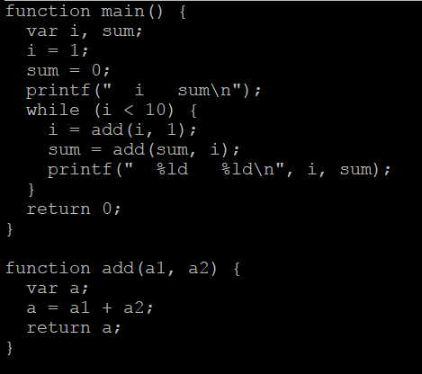

# microC Compiler
This repository consists of the many files necessary to compile and run a microC program

# What is microC?
microC is a simple, made up language. Here is an example of a microC program:

 
  

# How it Works
The compiler consists of a few classes:
1. A Token class which defines the different units of grammar in the microC language.
2. A Lexer class, short for lexical analyzer, which takes each lexeme (token without meaning) and tokenizes it.
3. A Parser class which parses the tokenized code, creates a Parse Tree, performs a post-order traversal of the tree, and generates Assembly code. 
4. A SymbolTable class used to store variables and keep track of variable scope.
5. HashTable, Hash, Link, and Stack classes used throughout the program.

# How to Compile and Run microC Program
1. In Unix, in the "Compiler" directory, type "make clean", "make", and run "microc testcu.mc", "microc fact.mc", or "microc calendar.mc". This compiles the microC program.
2. The output should be the Assembly code necessary to run the program on Intel architecture.
